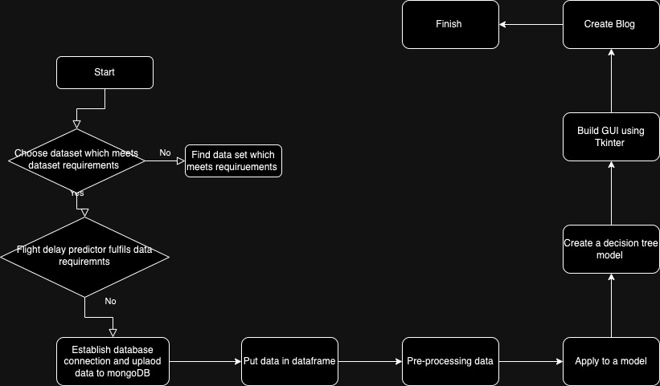
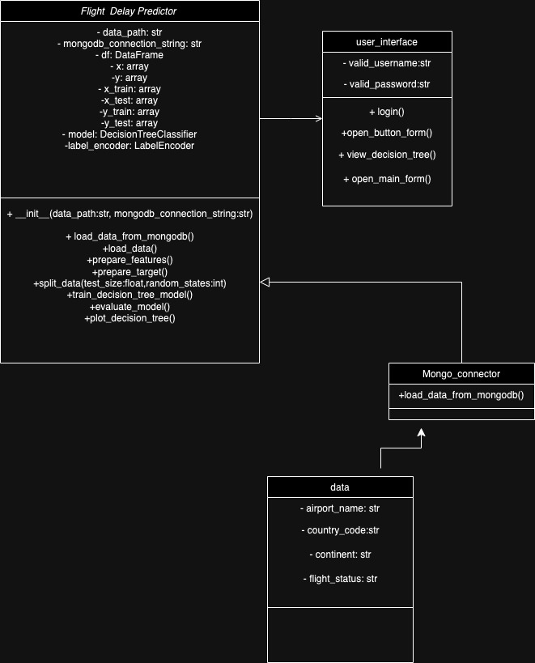

# Flight Delay Predictions

## Introduction

Flight delays can have a negative impact on airline operations, for both passenger experiences and loss of resources for airlines (Adolph et al , 2014). In addition to this flight delays are a common source of frustration for travellers, hence anticipating delays in advance can significantly improve the passengers experience (Hogan, 2011). By accurately predicting delays and their causes, airlines can optimize their operations, leading to reduced costs (Nagy,2019).

Initially this project started with finding a data set which met data set requirements and solved a real-life problem. Since flight delays can negatively influence airline operations and customer satisfaction, developing a model to predict flight delays can reduce the chances of this occurring and allows airline business to prepare and handle delays better (Redpath et al, 2017). To build this programme a flight delay prediction dataset from Kaggle was implemented. This dataset has fifteen columns originally but only three of them – ‘airport name’, ‘airport country code’ and ‘airport continent’ were used as feature columns, to predict flight delays. Other columns such as ‘pilot name’ was not utilised since it didn’t have a significant impact on the prediction task at hand. Further columns such as ‘passenger ID’, ‘first name’, ‘last name’ , ‘age’ and ‘nationality’ were also not utilised to ensure data privacy and security (Balatsko,2019).

## Planning and Designing

(figure 1)

For this project the decision tree classifier from scikit-learns library was used for classification since the target variable was categorical, whether a flight is delayed or on time. Hazan (2022) further supports this by mentioning utilising decision trees can provide information about feature importance, providing insight into which features are most influential in making a prediction.

To further support the planning of this project a flowchart was utilised to visualise the logical steps taken to complete this project. This was necessary to simplify the complex processes by breaking them down into manageable components (Malik,2022).

(figure 2)

The project uses Object Orientated Programming to visualise this a Unified Modelling Language was implemented. As seen in figure 2 the UML diagram visually depicts the structure and functions of classes as well as their interactions.

(Figure 3)

To plan for the User interface a user story was used to capture how the interfaces should function and what it should look like. In addition to this Bezerra (2021) states that user stories provide clear goals and objectives for the User Interface (UI). Figure 3 below shows the user story implemented during the planning process of this project.

## Building the Programme

The next step of the project was to build the programme. MongoDB was utilised to initially retrieve data by storing the flight data as documents within a MongoDB collection. MongoDB was further utilised to load data and transform data through using the panda’s library.

The Flight Delay Predictor Class was built through several logical steps these include data loading this function connects to MongoDB database and retrieves flight data. Feature preparation was the next step of building the flight predictor class the prepare features function pre-processes and prepares features for test and train model. In this project categorical features were handled using one-hot encoding and scaling the features using StandardScaler. The next logical step was to prepare the target the prepare target function encodes the variable ‘flight status’ using label encoding. Moreover, the Flight delay predictor class encapsulates the following steps target preparation, data splitting, model training, model evaluation, visualisation, and main execution.

To create the visualisation of the decision tree it required to import the necessary decision tree classifier library, training the model, and evaluating its performance on the test data. Then the decision tree classifier uses the trained model to make predictions.

The functionality and dependability of the application are confirmed through testing and validation. The programme thoroughly tests the user interface, authentication, pre-processing, model training, and data loading. To make sure the model's predictions match the anticipated outcomes, data is checked.

To build the user interface the Tkinter library was used. The user interface of the project was built with three windows, the login window has also integrated an authentication process for logging in. The submit form function submits the flight data for prediction, through users entering their flight details in the text boxes and this data being collected.

Users can access the application once it has been launched following successful login authorization enabling users to view the Decision Tree and make predictions.

## Challanges

One of the challenges faced in this project was during feature preparations. The categorical features such as ‘Airport Name’, ‘Airport Country Code’ and ‘Airport continent’ needed to be transformed into numerical format which is suitable for machine learning model. One hot encoding was utilised to solve this challenge.

Another challenge faced during the data preparation was feature scaling specifically in selecting the right scaling method and ensuring that the scaling process did not alter the data.

Further challenges were faced during the target preparation, where label encoding was used to convert the categorical target feature ‘Flight Status’ into numerical labels. It was essential to ensure that the assigned labels accurately represent the meaning of the categories.

## Running the Programme

When the user runs the programme, the user is presented with a login window, which prompts the user to input login credentials, if the user enters incorrect details an error message will pop up. After successfully logging in the user will be presented with two buttons the predict button will load the main form and the decision tree button will load the decision tree.

#### Recording

(Figure 4)

The recording above shows the app being run in real time. The project was successful overall it used an algorithm that was suitable for the model, implemented OOP, and produced functional results.

## Conclusion

In conclusion, this project combines data preparation, model training, and user interface to provide users with insights into flight delays. It demonstrates the application of machine learning and user interface development to predict flight delays based on the following features such as airport name, country code and airport continent. However further improvement which can be made for this application include improving the UI through making it a more intuitive user experience.

#### References

Biehler, R. and Fleischer, Y. (2021) ‘Introducing students to machine learning with decision trees using CODAP and Jupyter notebooks’, Teaching Statistics, 43(S1). doi:10.1111/test.12279.

Efthymiou, M. et al. (2018) ‘The impact of delays on customers’ satisfaction: An empirical analysis of the British Airways on-time performance at Heathrow Airport’, SSRN Electronic Journal [Preprint]. doi:10.2139/ssrn.3253232.

Horváth, D. and Szabó, R.Zs. (2019) ‘Driving forces and barriers of industry 4.0: Do multinational and small and medium-sized companies have equal opportunities?’, Technological Forecasting and Social Change, 146, pp. 119–132. doi:10.1016/j.techfore.2019.05.021.

Krajnc, D. et al. (2022) ‘Automated Data Preparation for in vivo tumor characterization with machine learning’, Frontiers in Oncology, 12. doi:10.3389/fonc.2022.1017911.

Laming, C. and Mason, K. (2014) ‘Customer experience — an analysis of the concept and its performance in airline brands’, Research in Transportation Business &amp; Management, 10, pp. 15–25. doi:10.1016/j.rtbm.2014.05.004.

Marques, A.B. et al. (2022) ‘Enriching user stories with usability features in a remote agile project: A case study’, Proceedings of the XXI Brazilian Symposium on Software Quality [Preprint]. doi:10.1145/3571473.3571496.

Taheri, S.M., Sasaki, M. and Ngetha, H.T. (2015) ‘Evaluating the effectiveness of problem solving techniques and tools in programming’, 2015 Science and Information Conference (SAI) [Preprint]. doi:10.1109/sai.2015.7237253.
